# Milestone 1 - Preliminary Solution Diagram

**CyberFortNexus - Enterprise Cyber Defense System**

## High-Level Architecture Overview

The CyberFortNexus system consists of three major components working together to provide comprehensive cyber threat detection and investigation capabilities for enterprise networks.

```mermaid
graph TB
    Internet[Internet]

    subgraph "On-Premises Enterprise Infrastructure"
        Endpoints[User Endpoints<br/>Laptops, Devices, Servers]
        SOC[SOC Analysts<br/>Up to 50 Users]

        GW[Gateway Switch<br/>Traffic Mirroring<br/>Border to Internet]

        Buffer[Traffic Buffer<br/>Temporary Storage<br/>Handles Traffic Spikes]

        subgraph "CyberFortNexus - Threat Detection Sensors"
            FA[File Analysis Sensor<br/>Inbound Traffic<br/>Malware/Virus Scanning]
            CC[C&C Detector<br/>Outbound Traffic<br/>ML-based Detection]
            NF[Network Forensics<br/>Netflow Collector<br/>All Traffic Metadata]
        end

        subgraph "CyberFortNexus - Data Layer"
            AlertDB[(Alert Database)]
            ForensicsDB[(Forensics Database<br/>3-month retention)]
            UserDB[(User & Investigation DB)]
        end

        ACI[CyberFortNexus ACI<br/>Automatic Cyber Investigator<br/>Correlation & Analysis Engine]

        subgraph "CyberFortNexus - Investigation Portal"
            Portal[Web Portal<br/>SOC Analyst Interface]
            Dashboard[Dashboard & Reports]
            InvMgmt[Investigation Management]
        end
    end

    %% Traffic flows
    Internet -->|Inbound Traffic| GW
    GW -->|Outbound Traffic| Internet
    Endpoints <-->|All Traffic| GW

    %% Gateway to buffer
    GW -->|Mirrored Traffic| Buffer

    %% Buffer to sensors
    Buffer -->|Buffered Files/Emails| FA
    Buffer -->|Buffered Packets| CC
    Buffer -->|Buffered Traffic| NF

    %% Sensor to databases
    FA -->|Malware Alerts| AlertDB
    CC -->|C&C Alerts| AlertDB
    NF -->|IP Flow Metadata| ForensicsDB

    %% ACI connections
    AlertDB -->|Alert Data| ACI
    ForensicsDB -->|Forensics Data| ACI
    ACI -->|Auto Investigations| UserDB

    %% Portal connections
    AlertDB -->|View Alerts| Portal
    ForensicsDB -->|Query Forensics| Portal
    UserDB <-->|Manage Investigations| Portal
    ACI -->|Investigation Results| Portal
    Portal --> Dashboard
    Portal --> InvMgmt

    %% User access
    SOC -->|Access| Portal

    classDef sensor fill:#8B0000,stroke:#FF6B6B,stroke-width:3px,color:#fff
    classDef core fill:#1E3A8A,stroke:#60A5FA,stroke-width:3px,color:#fff
    classDef data fill:#065F46,stroke:#34D399,stroke-width:3px,color:#fff
    classDef external fill:#92400E,stroke:#FBBF24,stroke-width:3px,color:#fff
    classDef buffer fill:#4C1D95,stroke:#A78BFA,stroke-width:3px,color:#fff
    classDef onprem fill:#1F2937,stroke:#9CA3AF,stroke-width:2px,stroke-dasharray: 5 5

    class FA,CC,NF sensor
    class ACI,Portal,Dashboard,InvMgmt core
    class AlertDB,ForensicsDB,UserDB data
    class Internet external
    class Buffer buffer
```

## Component Descriptions

### 1. Threat Detection Sensors (Gateway Layer)

- **Traffic Buffer**: Temporary storage to absorb traffic spikes before sensor processing
  - Prevents sensor overload during high traffic periods
  - Allows sensors to process at sustainable rate
  - Uses disk-based queue or fast storage (SSD/NVMe)
- **File Analysis Sensor**: Scans inbound files and emails for malware/viruses using 3rd party engines
- **C&C Detector**: ML-based detection of outbound Command & Control traffic
- **Network Forensics Collector**: Captures and indexes all IP flow metadata (timestamp, IPs, ports, protocol)

### 2. ACI - Automatic Cyber Investigator

- Central analysis engine that correlates data from all sensors
- Performs automatic queries to detect cyber incidents
- Generates investigation reports for SOC analysts

### 3. Investigation Portal

- Web-based interface for SOC analysts
- Features:
  - View and manage alerts
  - Query network forensics data
  - Manage investigations (manual and ACI-generated)
  - Dashboard and reporting
  - User management (up to 50 users with investigation isolation)

### 4. Data Layer

- **Alert Database**: Stores alerts from File Analysis and C&C sensors
- **Forensics Database**: Stores 3 months of IP flow metadata
- **User & Investigation Database**: Stores user accounts and investigation records

## Key Design Considerations

### Scalability

System must support three tiers:

- **Small**: 200 endpoints, 1 Gbps traffic
- **Medium**: 1,000 endpoints, 5 Gbps traffic
- **XLarge**: 10,000 endpoints, 50 Gbps traffic

### Architecture Approach

- **Cloud-native**: Container-based deployment
- **Microservices**: Independent, scalable components
- **Event-driven**: Sensors publish alerts/data, ACI consumes and correlates
- **99.9% Availability**: Redundancy and health monitoring

### Data Flow Summary

1. **Detection**: Sensors monitor gateway traffic and generate alerts
2. **Storage**: Alerts and forensics data stored in respective databases
3. **Analysis**: ACI correlates data and creates automatic investigations
4. **Investigation**: SOC analysts access portal to view, analyze, and manage incidents

---

**Note**: This is a preliminary high-level view. Detailed component design, APIs, data models, and technology stack will be defined in subsequent milestones.
