# Milestone 1 - Preliminary Solution Diagram

**Enterprise Cyber Defense System**

## High-Level Architecture Overview

The CyberFortNexus system consists of three major components working together to provide comprehensive cyber threat detection and investigation capabilities for enterprise networks.

```mermaid
graph TB
    Internet[🌐 Internet]

    subgraph "🏢 On-Premises Enterprise Infrastructure"
        Endpoints[💻 User Endpoints]
        SOC[👥 SOC Analysts]

        GW[🚪 Gateway Switch<br/>Traffic Mirroring]

        Buffer[📦 Traffic Buffer<br/>Handles Spikes]

        FA[📄 File Analysis<br/>Inbound Malware Detection]
        CC[🎯 C&C Detector<br/>Outbound Traffic Analysis]
        NF[🔍 Network Forensics<br/>Traffic Metadata Indexing]

        AlertDB[(🚨 Alerts)]
        ForensicsDB[(📊 Forensics<br/>3-month retention)]
        UserDB[(👤 Users & Investigations)]

        ACI[🧠 Automatic Cyber Investigator<br/>Correlation & Analysis]

        Portal[🌐 Investigation Portal<br/>Dashboard & Case Management]
    end

    %% Traffic flows
    Internet -->|Inbound| GW
    GW -->|Outbound| Internet
    Endpoints <-->|Traffic| GW

    %% Gateway to buffer
    GW -->|Mirror| Buffer

    %% Buffer to sensors
    Buffer -->|Files| FA
    Buffer -->|Packets| CC
    Buffer -->|Traffic| NF

    %% Sensor to databases
    FA -->|Alerts| AlertDB
    CC -->|Alerts| AlertDB
    NF -->|Metadata| ForensicsDB

    %% ACI connections
    AlertDB --> ACI
    ForensicsDB --> ACI
    ACI --> UserDB

    %% Portal connections
    AlertDB --> Portal
    ForensicsDB --> Portal
    UserDB <--> Portal
    ACI --> Portal

    %% User access
    SOC --> Portal

    classDef sensor fill:#8B0000,stroke:#FF6B6B,stroke-width:3px,color:#fff
    classDef core fill:#1E3A8A,stroke:#60A5FA,stroke-width:3px,color:#fff
    classDef data fill:#065F46,stroke:#34D399,stroke-width:3px,color:#fff
    classDef external fill:#92400E,stroke:#FBBF24,stroke-width:3px,color:#fff
    classDef buffer fill:#4C1D95,stroke:#A78BFA,stroke-width:3px,color:#fff

    class FA,CC,NF sensor
    class ACI,Portal core
    class AlertDB,ForensicsDB,UserDB data
    class Internet external
    class Buffer buffer
```

## Component Overview

### 1. Threat Detection Layer

Gateway-level sensors monitor network traffic and identify threats:

- **File Analysis**: Scans inbound files and emails for malware
- **C&C Detector**: Identifies outbound command & control traffic patterns
- **Network Forensics**: Indexes all traffic metadata for investigation

### 2. Data Storage Layer

Three specialized databases maintain system data:

- **Alerts Database**: Threat detections from sensors
- **Forensics Database**: 3-month archive of network traffic metadata
- **Investigation Database**: User accounts and case records

### 3. Analysis & Intelligence Layer

**Automatic Cyber Investigator (ACI)** correlates data from sensors and databases to automatically identify cyber incidents and generate investigation leads.

### 4. User Interface Layer

**Investigation Portal** provides SOC analysts with a unified interface to view alerts, query forensics, manage cases, and access dashboards. Supports up to 50 users with case isolation.

## System Characteristics

### Deployment Model

- On-premises installation at customer sites
- Cloud-native, container-based architecture
- Detection-only system (not mitigation)

### Scalability Tiers

| Tier   | Endpoints | Peak Traffic |
| ------ | --------- | ------------ |
| Small  | 200       | 1 Gbps       |
| Medium | 1,000     | 5 Gbps       |
| XLarge | 10,000    | 50 Gbps      |

### Non-Functional Requirements

- **Availability**: 99.9% uptime
- **Scalability**: All components horizontally scalable
- **Monitoring**: Health dashboards and centralized logging

### Data Flow

1. Gateway mirrors all traffic to sensors via buffer
2. Sensors analyze traffic and generate alerts → databases
3. ACI correlates data → automatic investigations
4. SOC analysts access portal → view/manage incidents

---

**Note**: This milestone provides the high-level architecture. Subsequent milestones will detail component design, APIs, data models, security architecture, and performance characteristics.
